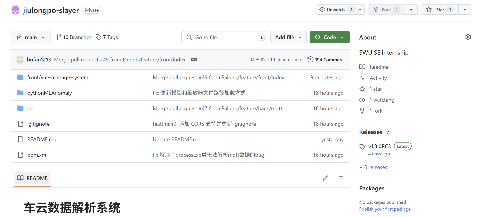
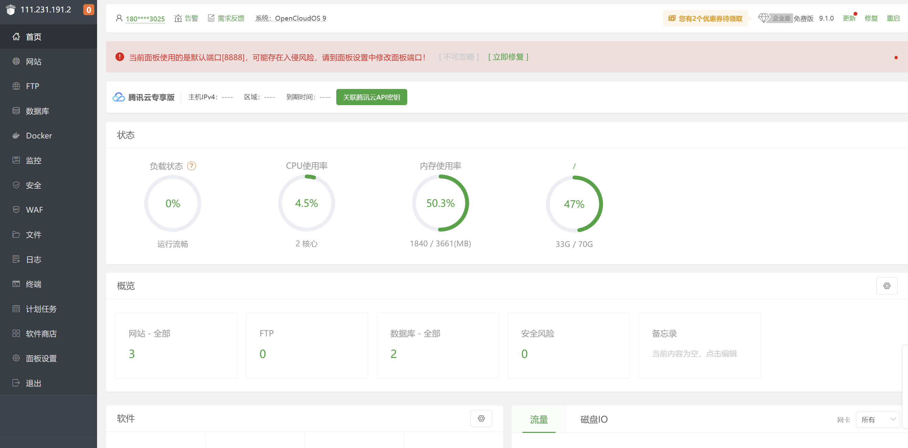
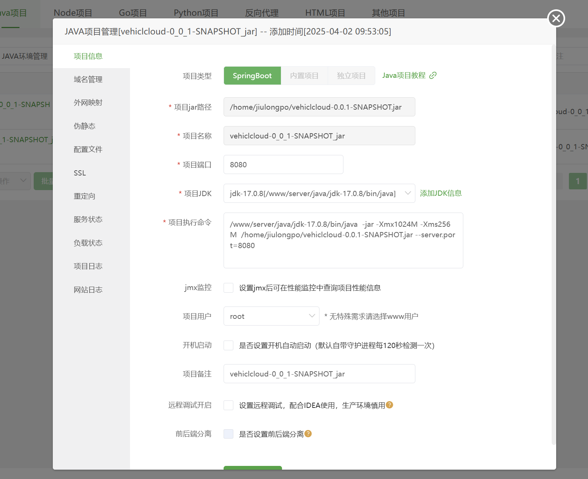
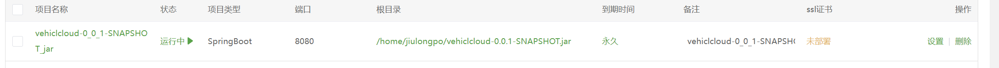

## 部署文档

#### 1.从github上下载我们的项目完整代码或releases中的jar包/压缩包

地址：[Painnb/jiulongpo-slayer: SWU SE Internship](https://github.com/Painnb/jiulongpo-slayer)



#### 2.1通过SSH直接连接远程云服务器

可以使用如下命令

```bash
ssh [用户名]@[服务器IP地址或主机名]
```

也可以使用xshell等管理软件连接

然后使用xftp等远程传输程序

后下载、安装正确版本的JDK17

并正确配置环境变量后（可使用教程：[centOs 7.8 （Linux） JDK17安装+环境配置_yum install jdk17-CSDN博客](https://blog.csdn.net/m0_73512487/article/details/139885799)）启动jar包

```bash
java -jar vehiclcloud-0.0.1-SNAPSHOT.jar
```

（注意：需要开启云服务器防火墙的80/8080/8081端口）

#### 2.2通过管理面板图形化部署

进入后台管理面板



上传项目至服务器

进入网站→java→添加java项目

找到你的jar包和对应jdk并启动



成功则正在运行中



### 3 Nginx配置

将静态页面打包至jar包同目录文件夹dist下

网站→php项目→nginx管理

nginx的配置如下

```ini
user  www www;
worker_processes auto;
error_log  /www/wwwlogs/nginx_error.log  crit;
pid        /www/server/nginx/logs/nginx.pid;
worker_rlimit_nofile 51200;

stream {
    log_format tcp_format '$time_local|$remote_addr|$protocol|$status|$bytes_sent|$bytes_received|$session_time|$upstream_addr|$upstream_bytes_sent|$upstream_bytes_received|$upstream_connect_time';
  
    access_log /www/wwwlogs/tcp-access.log tcp_format;
    error_log /www/wwwlogs/tcp-error.log;
    include /www/server/panel/vhost/nginx/tcp/*.conf;
}

events
{
    use epoll;
    worker_connections 51200;
    multi_accept on;
}

http
{
    include       mime.types;
    #include luawaf.conf;

    include proxy.conf;
    lua_package_path "/www/server/nginx/lib/lua/?.lua;;";

    default_type  application/octet-stream;

    server_names_hash_bucket_size 512;
    client_header_buffer_size 32k;
    large_client_header_buffers 4 32k;
    client_max_body_size 50m;

    sendfile   on;
    tcp_nopush on;

    keepalive_timeout 60;

    tcp_nodelay on;

    fastcgi_connect_timeout 300;
    fastcgi_send_timeout 300;
    fastcgi_read_timeout 300;
    fastcgi_buffer_size 64k;
    fastcgi_buffers 4 64k;
    fastcgi_busy_buffers_size 128k;
    fastcgi_temp_file_write_size 256k;
    fastcgi_intercept_errors on;

    gzip on;
    gzip_min_length  1k;
    gzip_buffers     4 16k;
    gzip_http_version 1.1;
    gzip_comp_level 2;
    gzip_types     text/plain application/javascript application/x-javascript text/javascript text/css application/xml application/json image/jpeg image/gif image/png font/ttf font/otf image/svg+xml application/xml+rss text/x-js;
    gzip_vary on;
    gzip_proxied   expired no-cache no-store private auth;
    gzip_disable   "MSIE [1-6]\.";

    limit_conn_zone $binary_remote_addr zone=perip:10m;
    limit_conn_zone $server_name zone=perserver:10m;

    server_tokens off;
    access_log off;

    # 配置 API 服务器，优先匹配 /api/ 路径
    server
    {
        listen 80 default_server;
        server_name 111.231.191.2;
        root /home/suijiwords;
        index index.html;

        # 处理 API 请求
        location /api/ {
            proxy_pass http://127.0.0.1:8080;
            proxy_set_header Host $host;
            proxy_set_header X-Real-IP $remote_addr;
            proxy_set_header X-Forwarded-For $proxy_add_x_forwarded_for;
            proxy_set_header X-Forwarded-Proto $scheme;
            proxy_http_version 1.1;
            proxy_set_header Connection "keep-alive";
            proxy_set_header Upgrade $http_upgrade;
        }

        # 处理静态文件请求
        location / {
            try_files $uri $uri/ /index.html;
        }

        location ~ .*\.(gif|jpg|jpeg|png|bmp|swf)$
        {
            expires      30d;
        }

        location ~ .*\.(js|css)?$
        {
            expires      12h;
        }

        location ~ /\.
        {
            deny all;
        }

        access_log  /www/wwwlogs/access.log;
    }

    # 配置 phpMyAdmin 服务
    server
    {
        listen 888;
        server_name phpmyadmin;
        index index.html index.htm index.php;
        root  /www/server/phpmyadmin;
            location ~ /tmp/ {
                return 403;
            }

        #error_page   404   /404.html;
        include enable-php.conf;

        location ~ .*\.(gif|jpg|jpeg|png|bmp|swf)$
        {
            expires      30d;
        }

        location ~ .*\.(js|css)?$
        {
            expires      12h;
        }

        location ~ /\.
        {
            deny all;
        }

        # 处理 PHP 文件，防止 405 错误
        location ~ \.php$
        {
            include fastcgi_params;
            fastcgi_pass 127.0.0.1:9000;
            fastcgi_param SCRIPT_FILENAME $document_root$fastcgi_script_name;
        }

        access_log  /www/wwwlogs/access.log;
    }

    include /www/server/panel/vhost/nginx/*.conf;
}
```

